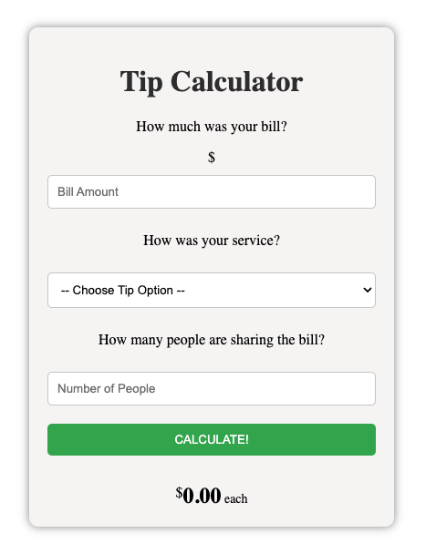

# Tip Calculator React Starter Code

## React+Vite

This template provides a minimal setup to get React working in Vite with HMR and some ESLint rules.

# UI View



```javascript
let totalTip = bill_amount * service_quality;
let totalTipPerPerson = (bill_amount * service_quality) / number_of_people;
```
